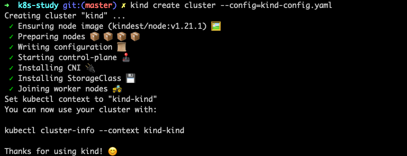

## 前言

## 1.windows安装

### 1.1前期准备(windows版)

> 1.安装docker desktop
>
> 2.安装kubectl(https://dl.k8s.io/release/v1.25.0/bin/windows/amd64/kubectl.exe),放入C:\Windows
>
> 3.安装kind(https://github.com/kubernetes-sigs/kind/releases/),下载后将后缀名改为.exe,放入C:\Windows
>
> 4.准备dockerhub仓库

### 1.2.通过kind初始化集群

```yaml
kind: Cluster
apiVersion: kind.x-k8s.io/v1alpha4
nodes:
  - role: control-plane
    extraPortMappings:
      - containerPort: 30080
        hostPort: 30080
        listenAddress: "0.0.0.0"
        protocol: tcp
  - role: worker
  - role: worker
  - role: worker
```

kind create cluster --config=kind-config.yaml

### 1.3.构建容器在k8s-cluster运行

- [ ] 通过dockerfile构建docker镜像

> docker build -t needkk/node-echo:v1.0.1 .

- [ ] 将构建的docker镜像push到docker hub仓库

> docker push needkk/node-echo:v1.0.1

- [ ] 编写manifest文件创建pod，deployment和service

## 2.Mac m1安装

### 2.1.前期准备（Mac版）

> 1.安装docker desktop
>
> 2.安装kubectl(https://kubernetes.io/zh-cn/docs/tasks/tools/install-kubectl-macos/)
>
> 3.安装kind(https://kind.sigs.k8s.io/docs/user/quick-start/)
>
> 4.准备dockerhub仓库
>
> 以下参考为Mac M1芯片的安装方式

```shell
# 安装kubectl
#下载最新的发行版：
curl -LO "https://dl.k8s.io/release/$(curl -L -s https://dl.k8s.io/release/stable.txt)/bin/darwin/arm64/kubectl"
#验证可执行文件（可选操作）
curl -LO "https://dl.k8s.io/release/$(curl -L -s https://dl.k8s.io/release/stable.txt)/bin/darwin/arm64/kubectl.sha256"
#根据校验和文件，验证 kubectl：
echo "$(cat kubectl.sha256)  kubectl" | shasum -a 256 --check
#如果校验和匹配，则输出：
kubectl: OK
#将 kubectl 置为可执行文件：
chmod +x ./kubectl
#将可执行文件 kubectl 移动到系统可寻址路径 PATH 内的一个位置：
sudo mv ./kubectl /usr/local/bin/kubectl
sudo chown root: /usr/local/bin/kubectl
#测试一下，确保你安装的是最新的版本：
kubectl version --client
#或者使用下面命令来查看版本的详细信息：
kubectl version --client --output=yaml
```

```shell
# 安装kind
#下载最新的发行版：
curl -Lo ./kind https://kind.sigs.k8s.io/dl/v0.11.0/kind-darwin-arm64
#将 kind 置为可执行文件：
chmod +x ./kind
#将可执行文件 kind 移动到 PATH 内的一个位置：
mv ./kind /usr/local/bin/kind
```

### 2.2.通过kind初始化集群

```yaml
kind: Cluster
apiVersion: kind.x-k8s.io/v1alpha4
nodes:
  - role: control-plane
    extraPortMappings:
      - containerPort: 30080
        hostPort: 30080
        listenAddress: "0.0.0.0"
        protocol: tcp
  - role: worker
  - role: worker
  - role: worker
```

kind create cluster --config=kind-config.yaml



## 3.执行manifest文件

```shell
kubectl apply -f deploymement.yaml
```

